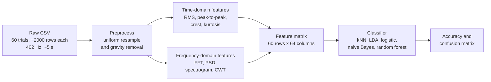

# Smartphone-Based Vibration Signature Analysis: Project Report

This report walks through the whole project from start to finish. It states what the
project does, how the data was collected, what every processing stage computes, what
each number and figure means, and how the final classifier performs. Read it top to
bottom to understand what each part is and what the project builds.

---

## 1. Overview and result

This project answers one question: can a smartphone accelerometer alone tell apart four
mechanical motion modes of a small test rig? The answer is yes. Four modes produce four
distinct vibration signatures, and a simple classifier separates them at roughly 95 to 97
percent cross-validated accuracy.

A custom piston-servo rig generates the motion. The rig runs in four modes: a linear
piston motion, a rotational servo motion, both motions together, and both motions taking
turns. A phone bolted to the rig records acceleration along three axes. The processing
pipeline turns each recording into a compact set of numbers, and a classifier maps those
numbers to the correct mode.

The figure below plots every recording by two of those numbers: how much vibration energy
falls on the phone x-y plane (horizontal axis, the servo rotation) versus the z axis
(vertical axis, the piston motion). The four modes fall into four regions, which previews
why classification succeeds.


The pipeline has five stages:



---

## 2. The experimental apparatus

### 2.1 Mechanical design

A custom piston-servo test rig generates combined linear and rotational motion. Four
200 RPM DC gear motors sit inside a plastic enclosure. The four motor shafts pass through
the lid and drive a single common toothed rack through 3D-printed pinions. The four
motors therefore produce one shared linear motion along the rack axis, which the phone
reads as its z axis.

An MG996R servo mounts on the rack itself. The servo moves with the rack and also rotates
about its own axis. The phone bolts onto the servo horn, so the phone sits at the one
point where translation from the rack and rotation from the servo combine. The servo
rotation axis aligns with the rack travel direction, which keeps the rotation confined to
the phone x-y plane and keeps it out of the z axis reading. This mechanical choice maps
each motion source onto a separate accelerometer axis, and that separation is what makes
the four modes distinguishable.

### 2.2 Electrical control

An Arduino Uno with an L293D motor-driver shield controls the four DC motors and the
servo. The four motors drive the rack in one direction for one second, then reverse for
one second, which gives a two-second push-pull cycle at 59 percent motor power. The servo
runs on its own schedule, so it can rotate while the rack moves, while the rack sits
still, or in alternation with the rack. A two-cell 18650 lithium-ion pack powers the
electronics through an inline switch.

### 2.3 Motion classes

The rig runs in four operating modes, listed in the table below. The stationary benchmark
is a fifth recording with the rig switched off, used only to check preprocessing, not for
classification.

| Class | Rack (linear, z axis) | Servo (rotation, x-y plane) |
|---|:---:|:---:|
| Piston only | active | still |
| Servo only | still | active |
| Both simultaneous | active | active, together |
| Both alternating | active | active, taking turns |

---

## 3. Data acquisition

### 3.1 Sensor and application

The phone records acceleration with its built-in MEMS accelerometer through the Phyphox
application. Phyphox logs three axes of acceleration plus the acceleration magnitude, and
it exports the data as CSV. The mounting position and orientation stay fixed across all
recordings, so differences between recordings reflect the operating mode rather than a
change in mounting.

### 3.2 Sampling

Phyphox samples at approximately 402.1 Hz, which corresponds to one reading every
0.00249 seconds. Each recording lasts about five seconds. The raw timestamps are not
perfectly evenly spaced, so preprocessing resamples every recording onto a uniform time
grid before any frequency analysis runs.

### 3.3 Procedure

Data collection followed a fixed sequence for every trial. First, mount the phone on the
servo horn. Second, start the Phyphox recording. Third, select one of the four operating
modes. Fourth, run the rig in that mode. Fifth, record about five seconds of three-axis
acceleration. Sixth, save and export the recording. Seventh, repeat until 15 recordings
exist for that class. A separate stationary recording of about 30 seconds provides the
benchmark.

---

## 4. The dataset and a glossary of its numbers

Three different counts describe this dataset, and mixing them up causes most of the
confusion around dataset size. The table lists all three.

| Quantity | Value | Meaning |
|---|---:|---|
| Classes | 4 | the motion modes |
| Recordings (trials) | 60 (15 per class) | one five-second capture with one label |
| Stationary benchmark | 1 | rig off, used only to verify preprocessing |
| Readings per recording | about 2,000 | accelerometer rows at 402 Hz over 5 s |
| Total readings | 119,761 | sum over the 60 recordings |
| Feature matrix | 60 rows x 64 columns | one 64-number vector per recording |
| Raw data on disk | about 12 MB | the folder `data/raw/` |

The label belongs to the recording, not to each reading. The roughly 2,000 rows inside
one trial form one continuous five-second event under one label, so those rows are not
2,000 independent examples. The pipeline compresses each recording of about 2,000 rows
into one 64-number vector. The classifier therefore learns from 60 examples, not from
119,761. Section 11 demonstrates with an experiment why classifying individual rows fails.

---

## 5. Preprocessing (`data/raw/preprocessing.py`)

Preprocessing runs two steps in a fixed order: resample first, then remove gravity.

### 5.1 Uniform resampling

Phone timestamps drift slightly from a fixed interval, yet the Fourier transform and the
wavelet transform both assume a constant sample spacing. The resampling step interpolates
each axis linearly onto a uniform 402.1 Hz grid, which gives every downstream transform a
valid time base.

### 5.2 Gravity removal

Raw acceleration still contains gravity at about 9.8 meters per second squared, and
gravity sits almost entirely at 0 Hz. A fourth-order Butterworth low-pass filter with a
0.3 Hz cutoff estimates the slow gravity component on each axis. Subtracting that estimate
from the raw signal leaves the motion component, which is equivalent to a 0.3 Hz high-pass
filter. The filter runs forward and backward (zero phase) so it introduces no time shift.
The pipeline recomputes the acceleration magnitude from the gravity-removed axes as the
Euclidean norm of the x, y, and z components.

### 5.3 Verification (`verify_preprocessing.py`)

The verification script confirms the results and writes them to
`data/preprocessed/verification_results/`. All 60 recordings pass the sampling check at a
uniform 402.1 Hz. The per-axis mean after gravity removal sits near zero for the servo
class, which confirms that the filter removes the constant gravity offset.

### 5.4 A residual caveat

The 0.3 Hz high-pass filter has a settling time comparable to the five-second record
length. For the piston-driven classes, whose genuine motion sits near that cutoff, the
filter leaves a small residual low-frequency drift, with per-recording z-axis means
reaching plus or minus 2.5. This residual inflates the shape features (crest factor and
kurtosis), which is why Section 12 finds those features noisy. The energy features that
the classifier uses stay robust to this residual, so the residual does not affect the
final accuracy.

---

## 6. What the signals look like

The figure below shows one representative recording per class with all three axes
overlaid. Each panel reveals the motion signature directly.


Panel (a), piston only, shows sharp z-axis bursts at the rack reversals and a flat x-y
response. Panel (b), servo only, shows x and y jerks with a flat z response, because the
servo rotation does not move the phone along z. Panel (c), both simultaneous, shows all
three axes active at once. Panel (d), both alternating, shows z-heavy stretches and
x-y-heavy stretches that take turns over time. The alternation in panel (d) defines that
class, and it appears here as separate green stretches and blue-orange stretches rather
than as a constant mixture.

---

## 7. Frequency content

The figure below shows the Fourier amplitude spectrum of the acceleration magnitude for
each class from 0 to 30 Hz.


Every class concentrates its energy below about 5 Hz, which matches the slow push-pull
rate, the rotation rate, and their low harmonics. The vertical scales differ across
panels: piston and both-simultaneous reach about 2 meters per second squared, while servo
reaches only about 0.8, which confirms that servo carries the least energy of the four
modes. These spectra form the raw material that the frequency-domain features summarize.

---

## 8. Time-domain features (`time_domain_analysis.py`)

The time-domain stage computes four numbers per axis on the gravity-removed signal. The
table defines each feature and states what it measures.

| Feature | Definition | What it measures |
|---|---|---|
| RMS | square root of the mean of the squared samples | overall vibration energy level |
| Peak-to-peak | maximum minus minimum | the largest swing in the signal |
| Crest factor | peak divided by RMS | spikiness, high for sharp transients on a quiet background |
| Kurtosis | fourth standardized moment minus 3 | tail heaviness, high for impulsive signals, 0 for Gaussian |

RMS and peak-to-peak both grow with amplitude. Crest factor and kurtosis instead describe
signal shape and stay roughly constant under a change of amplitude.

---

## 9. Frequency-domain features (`frequency_domain_analysis.py`)

The frequency-domain stage removes the mean of each axis, then computes the metrics in the
table below. The stage also saves per-trial FFT, power-spectral-density, spectrogram, and
wavelet plots under `results/frequency_domain_analysis/`.

| Feature | What it measures |
|---|---|
| FFT dominant frequency | the single strongest vibration frequency |
| FFT dominant amplitude | the size of that strongest frequency |
| PSD spectral centroid | the energy-weighted average frequency, the spectrum center of mass |
| PSD spectral bandwidth | the spread of energy around the centroid |
| PSD spectral RMS and total power | the total energy in the spectrum, which equals the time-domain RMS energy |
| PSD F95 | the frequency below which 95 percent of the power lies |
| CWT dominant frequency and amplitude | the strongest frequency from a wavelet analysis, which captures transients well |
| CWT global and mean wavelet power | the total time-frequency energy |

FFT stands for fast Fourier transform, PSD stands for power spectral density, and CWT
stands for continuous wavelet transform. The large per-trial wavelet CSV files serve as
intermediate output and do not feed the classifier.

---

## 10. The feature matrix: what a feature vector is

The feature matrix bridges the signals to the machine-learning stage. The file
`results/tables/feature_matrix.csv` holds a 60 by 64 table: one row per recording, and 64
columns that describe that recording. The 64 columns form the vibration fingerprint of the
recording.

The 64 features come from three groups:

- Time-domain features: 4 metrics (RMS, peak-to-peak, crest, kurtosis) across 4 axes
  (x, y, z, magnitude), which gives 16 features.
- Frequency-domain features: the 11 metrics of Section 9 across 4 axes, which gives 44
  features.
- Engineered features: `xy_TotalPower`, `z_TotalPower`, `z_over_xy_power`, and `xy_RMS`,
  which gives 4 features.

The total reaches 64 features. Three of those numbers already reveal the class, as the
table shows for one recording of each of three classes.

| Feature | piston trial 01 | servo trial 01 | both-alt trial 01 |
|---|---:|---:|---:|
| `z_TotalPower` (linear energy) | 15.8 | 0.02 | 4.6 |
| `xy_TotalPower` (rotation energy) | 0.26 | 4.3 | 4.2 |
| `z_over_xy_power` (the ratio) | 60.8 | 0.004 | 1.1 |

Piston shows all z energy and almost no x-y energy. Servo shows the opposite. The two
combined modes show energy on both axes.

---

## 11. Why per-recording features, not per-row

A tempting idea proposes classifying each of the roughly 120,000 raw readings on its own,
which would create a large dataset. A direct test rejects this idea, because a single
instant does not contain the class. The table reports the test, evaluated honestly by
splitting on whole recordings so that no recording appears in both training and test.

| Approach (split by recording) | Accuracy |
|---|---:|
| Per-row raw values (x, y, z) | 47 % |
| Per-row engineered features (magnitude, energy split, angle) | 54 % |
| Chance | 25 % |
| Per-recording features (the pipeline) | 95 to 97 % |

Feature engineering on a single instant raises accuracy from 47 to 54 percent, yet it
stalls far below the per-recording result. The stall has a concrete cause. At a single
instant, a both-alternating reading looks like a piston reading or a servo reading,
depending on which motion fires at that millisecond. The distinction between "alternating"
and "simultaneous" exists only across time, so no single-instant feature captures it. A
per-row model with a random split reaches about 68 percent, but that number is a leakage
artifact: neighboring rows from the same recording land in both training and test, so the
model memorizes recordings rather than learning motion. The honest unit of analysis is one
feature vector per recording, or per short time window (see Section 16).

---

## 12. Exploratory data analysis (`scripts/eda.py`)

### 12.1 Class separation in two features

Section 1 shows the feature-space figure. Servo sits alone at low z energy, piston sits
alone at low x-y energy, and the two combined modes cluster at high energy on both axes.
Two features separate three classes. The overlap between both-simultaneous and
both-alternating in that figure marks the fourth class as the hard one.

### 12.2 Feature distributions

The figure below shows the distribution of six informative features across the four
classes as box plots with the underlying points overlaid.


`z_TotalPower` isolates servo at a value near zero. `xy_TotalPower` isolates piston at a
value near zero. `xy_RMS` sits lower for both-alternating (about 1.9) than for
both-simultaneous (about 2.6), because the servo runs only part of the time in the
alternating mode. That gap in `xy_RMS` gives the handle for separating the two combined
modes. `Crest_aabs` overlaps heavily across classes, which marks it as a weak feature.

### 12.3 Feature discriminability

The figure below ranks features by the one-way ANOVA F-statistic. A larger F-statistic
means a feature separates the four classes more strongly.


Energy features dominate the ranking: the wavelet global power and the RMS features lead,
while the shape features rank low. The top F-values reach about 500 with p-values near
ten to the minus 40, which shows that the class differences are large, not marginal.

### 12.4 Feature redundancy

The figure below shows the correlation between the top 15 features.


The features collapse into two blocks. One block holds the x-y energy features, correlated
at 0.9 to 1.0 with each other. The other block holds the z energy features. The two blocks
correlate weakly with each other. The 64 features therefore carry roughly two independent
dimensions of information: x-y energy and z energy. This structure explains why two or
three features suffice and why adding more features adds little.

### 12.5 Multivariate structure

The figure below projects all 64 features into two dimensions two ways: principal
component analysis on the left and linear discriminant analysis on the right.


Principal component analysis, an unsupervised projection, already shows three clear
clusters with both-alternating spread through the middle. Linear discriminant analysis, a
supervised projection that uses the labels, packs all four classes into tight separated
clusters. The supervised projection confirms that the classes separate in the full feature
space, including the two combined modes. The linear discriminant projection fits 64
features on 60 samples, so it flatters the separation; treat it as directional evidence
rather than as a held-out accuracy.

---

## 13. Classification (`scripts/classify.py`)

### 13.1 Feature selection

The classifier uses three features chosen from the separability analysis of Section 12:
`log10(z_TotalPower)`, `log10(xy_TotalPower)`, and `xy_RMS`. The first isolates servo, the
second isolates piston, and the third splits the two combined modes. The two power
features receive a base-10 logarithm because their raw values span several orders of
magnitude, and a logarithm brings the classes onto a comparable scale.

### 13.2 Validation protocol

Two evaluations run side by side. The first holds out a stratified 30 percent validation
set, which gives 42 training recordings and 18 validation recordings with balanced
classes. The second runs stratified five-fold cross-validation over all 60 recordings.
The dataset holds only 60 recordings, so a single split gives a noisy estimate, and the
cross-validated number gives the estimate to quote. "Stratified" means each split keeps the
class proportions equal. "Pooled out-of-fold" means every recording gets predicted once by
a model that never saw that recording, which yields the fairest single confusion matrix.

### 13.3 Model comparison

The figure and table below compare five models by cross-validated accuracy. Gradient
boosting was tested and dropped, because a boosted ensemble overfits a 60-sample dataset.


| Model | Validation (18 held out) | 5-fold CV | Pooled out-of-fold |
|---|---:|---:|---:|
| Random forest | 100.0 % | 96.7 % ± 4.1 | 96.7 % |
| Gaussian naive Bayes | 94.4 % | 96.7 % ± 6.7 | 96.7 % |
| LDA | 94.4 % | 95.0 % ± 4.1 | 95.0 % |
| k-nearest neighbours (k=5) | 94.4 % | 93.3 % ± 6.2 | 93.3 % |
| Logistic regression | 88.9 % | 93.3 % ± 6.2 | 93.3 % |

The five models land within a 3.4-point band, from 93.3 to 96.7 percent cross-validated.
Random forest and Gaussian naive Bayes lead at 96.7 percent, 3.4 points above logistic
regression and k-nearest neighbours at 93.3 percent. The standard deviation term states
how much the accuracy moves across the five folds, and the term stays near 4 to 7 points
because each fold holds only 12 recordings.

### 13.4 Confusion matrices

The figure below shows the pooled out-of-fold confusion for the two strongest models.
Rows give the true class, columns give the predicted class, and each cell counts
recordings.


Piston, servo, and both-simultaneous reach a perfect 15 out of 15 in both models. Every
error falls on both-alternating: random forest classifies 13 of 15 correctly, and LDA
classifies 12 of 15 correctly. The misread both-alternating recordings go to piston or to
both-simultaneous, which matches the temporal explanation of Section 11.

### 13.5 Decision regions

The figure below draws the decision boundaries of an LDA classifier in the two energy
features after standardization. Each colored region marks where a recording receives that
class label.


Servo owns the upper-left region, piston owns the lower-right region, and both-simultaneous
owns the upper-right region. Both-alternating occupies a thin wedge in the middle that
borders all three other regions, which explains directly why the few errors happen on that
class.

### 13.6 Learning curves

The figure below plots accuracy against the number of training recordings for each model.
The orange line gives training accuracy and the blue line gives cross-validated accuracy,
with a shaded band for the standard deviation.


These learning curves show accuracy as a function of training-set size. For these
non-iterative models a loss-against-epoch curve does not apply, so a learning curve serves
as the training curve. Every model reaches a plateau by about 30 training recordings. The
flat right end shows that more recordings of the same kind would add little accuracy, which
places the roughly 95 to 97 percent ceiling on the features rather than on the dataset
size. The random forest training accuracy sits pinned at 100 percent above its
cross-validated line, which shows the mild overfitting expected from a tree ensemble.

---

## 14. Results and discussion

The four motion modes produce genuinely distinct signatures. The one-way ANOVA F-values
reach about 500 with p-values near ten to the minus 40, and five simple models all reach 93
to 97 percent cross-validated accuracy on three interpretable features. Three of the four
modes reach perfect classification: piston, servo, and both-simultaneous.

Both-alternating remains the single hard class. That mode shares its two motion ingredients
with the other modes and differs from both-simultaneous only in timing. The per-recording
features capture that timing difference only partly, through the lower average x-y energy
of the alternating mode. Every model fails on the same recordings, which shows that the
ceiling comes from the features rather than from the model.

Simple models win on this dataset. On 60 recordings, a more flexible model overfits more,
which is why gradient boosting scored lowest before being dropped and why a linear or
distance-based model matches or beats the ensemble. This outcome matches the project brief,
which asks for a simple classifier on two or three features.

---

## 15. Limitations

The dataset holds only 60 recordings, so every accuracy carries a confidence band of about
5 points, and the cross-validated figure gives the fair estimate rather than a single
split. The data comes from one session on one rig with a fixed mounting, so the classifier
learns the signatures of this specific setup and would not transfer to a different rig
without new data. The gravity-removal residual of Section 5 makes the shape features noisy,
so the classifier relies on energy features instead. The features carry no explicit timing
information, which sets the ceiling on the both-alternating class.

---

## 16. Future work

One change would raise the both-alternating accuracy: a windowed temporal feature. Cutting
each five-second recording into one-second windows produces a few hundred examples, and a
feature that measures how the z energy and the x-y energy trade off over time would capture
the alternation directly. That windowed temporal feature offers the clearest path past the
roughly 97 percent ceiling. Recording more sessions with remounting would test whether the
signatures generalize beyond a single setup.

---

## 17. How to reproduce

Run the following commands from the repository root:

```bash
python3 data/raw/preprocessing.py data/raw             # raw to data/preprocessed
python3 data/preprocessed/time_domain_analysis.py      # time-domain metrics
python3 data/preprocessed/frequency_domain_analysis.py # frequency-domain metrics
python3 scripts/eda.py                                 # feature matrix and EDA figures
python3 scripts/signal_plots.py                        # signal and spectrum figures
python3 scripts/classify.py                            # models, curves, confusion
```

The scripts write CSV tables to `results/tables/` and figures to `results/plots/` in both
PDF and PNG. All figures use the vendored ICLR style in `scripts/iclr_style/`.

---

## 18. Glossary of the numbers

| Number | Meaning |
|---|---|
| 4 | motion classes |
| 60 | labeled recordings, the classifier samples, 15 per class |
| 64 | features per recording |
| 61 | recordings including the stationary benchmark |
| about 2,000 | accelerometer readings inside one recording |
| 119,761 | total accelerometer readings across the 60 recordings |
| 402.1 Hz | sampling rate |
| 42 / 18 | training and held-out validation recordings |
| 93 to 97 % | cross-validated accuracy range across the five models |

*A condensed results-only summary lives in `RESULTS.md`.*
