# Smartphone-Based Vibration Signature Analysis — Project Report

A start-to-bottom walkthrough of the whole project: what it is, how the data was
collected, every processing stage, what each number and plot means, and the final
classifier. Read top to bottom and you should understand *what was what* and *what
we built*.

---

## 1. What this project is (in one page)

**Goal.** Using only a smartphone's built-in accelerometer, record the vibration of
a small mechanical rig running in four different motion modes, and train a classifier
that can tell the four modes apart from the vibration alone.

**The four classes** (what the rig is doing):

| Class | Linear motion (rack) | Rotation (servo) |
|---|:---:|:---:|
| **Piston only** | ✓ | — |
| **Servo only** | — | ✓ |
| **Both simultaneous** | ✓ | ✓ (together) |
| **Both alternating** | ✓ | ✓ (taking turns) |

**Headline result.** The four modes produce clearly distinct vibration signatures.
A simple classifier on **3 features** reaches **~95–97 % cross-validated accuracy**;
three of the four classes are essentially perfect, and the only recurring confusion
is on *both-alternating*.

**The pipeline we built:**

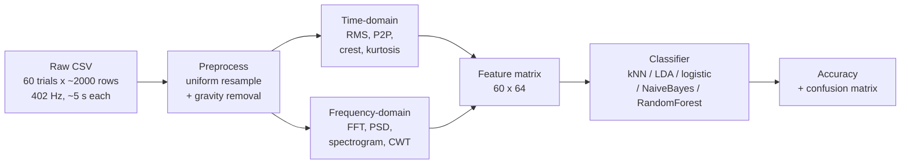

---

## 2. The apparatus and how the data was collected

**The rig that produced the vibration** — a custom *piston–servo test rig*:

- **4 × 200 RPM DC gear motors** drive a common **toothed rack** → produces **linear**
  motion along the phone's **z-axis**. The rack does a push–pull cycle: 1 s one way,
  1 s back (a 2 s cycle) at ~59 % motor power.
- An **MG996R servo** is mounted *on* the rack with the phone bolted to its horn →
  produces **rotational** motion in the phone's **x–y plane**.
- Controlled by an **Arduino Uno + L293D** motor shield, powered by a 2-cell 18650 pack.

Because the servo sits on the rack, the single point where the phone attaches carries
both motions — which is exactly what makes the four modes separable on different axes.

**The sensor and recording:**

- The phone's built-in **MEMS accelerometer**, logged with the **Phyphox** app.
- Phone **rigidly mounted** on the servo horn, orientation kept identical across trials.
- **Tri-axial** acceleration (x, y, z) at **≈ 402.1 Hz**, **~5 s** per trial, exported as CSV.
- Procedure per trial: mount → start Phyphox → select a mode → run the rig → record ~5 s →
  export → repeat until **15 recordings** exist for that class.

---

## 3. The dataset — and a glossary of the numbers

This project has three different "counts" that are easy to mix up. Here they all are:

| What you count | How many | What it is |
|---|---:|---|
| Classes | 4 | the motion modes |
| **Recordings (trials)** | **60** (15 each) | one ~5 s capture = **one label** → the classifier's samples |
| Stationary benchmark | 1 | phone still, ~30 s, used only to verify preprocessing |
| Raw time-samples per trial | ~2,000 | accelerometer readings (rows in the CSV) at 402 Hz × 5 s |
| **Total raw readings** | **119,761** | across the 60 trials (~132 k including the benchmark) |
| **Feature matrix** | **60 × 64** | one 64-number feature vector per recording |
| Numbers in the feature matrix | 3,840 | 60 × 64 |
| Raw dataset on disk | ~12 MB | `data/raw/` |

**Key idea (this trips everyone up):** the label belongs to the **recording**, not to each
reading. The ~2,000 rows inside one trial are one continuous 5-second event with a single
label, so they are **not** 2,000 independent examples. The whole pipeline exists to squeeze
each ~2,000-row recording into **one 64-number feature vector**. That is why the classifier
has **60 samples**, not 120,000. (Section 11 shows, with an experiment, why per-row
classification does not work.)

---

## 4. Preprocessing (`data/raw/preprocessing.py`)

Two steps, in this order:

1. **Uniform-time-base resampling.** Phone timestamps are not perfectly evenly spaced, but
   FFT/CWT assume a fixed sample interval, so each trial is linearly interpolated onto a
   uniform **402.1 Hz** grid.
2. **Gravity removal.** Raw acceleration still contains gravity (~9.8 m/s²). A 4th-order
   Butterworth **low-pass at 0.3 Hz** estimates the slow gravity component per axis; that
   estimate is subtracted, leaving just the motion (a high-pass at 0.3 Hz). The magnitude
   `|a| = √(x²+y²+z²)` is then recomputed from the gravity-removed axes.

**Verification** (`verify_preprocessing.py`, `data/preprocessed/verification_results/`):
all **60/60** trials pass the sampling check (402.1 Hz, uniform), and gravity is removed
(per-axis means near zero for servo).

> **Caveat (found during code review).** The 0.3 Hz high-pass has a settling time comparable
> to the 5 s record length, so for the piston-driven classes it leaves a small residual
> low-frequency wobble (per-file z-mean up to ±2.5). This mostly affects the *shape* features
> (crest factor, kurtosis) and is why those turn out noisy — the **energy** features we
> actually use are robust to it.

---

## 5. What the signals look like

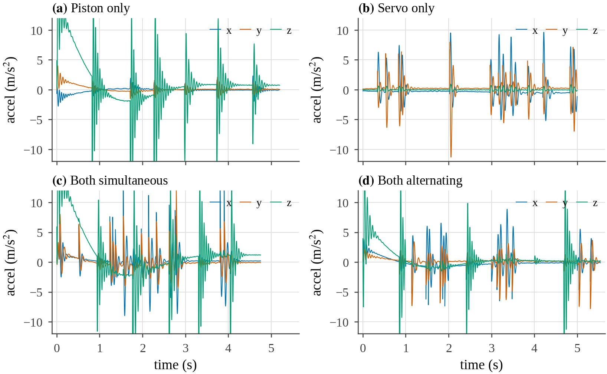

One representative preprocessed recording per class, all three axes overlaid. Read it and the
classes explain themselves:

- **(a) Piston only** — sharp **z** (green) bursts at the rack's push–pull reversals; x–y flat.
- **(b) Servo only** — **x, y** (blue/orange) jerks; **z** essentially flat (the servo does not
  move the phone along z).
- **(c) Both simultaneous** — all three axes active, densely, at the same time.
- **(d) Both alternating** — bursts of z-activity and x–y-activity that **take turns** over time.
  This alternation is the whole identity of the class, and it is visible here as separate
  green-heavy and blue/orange-heavy stretches.

---

## 6. Frequency content

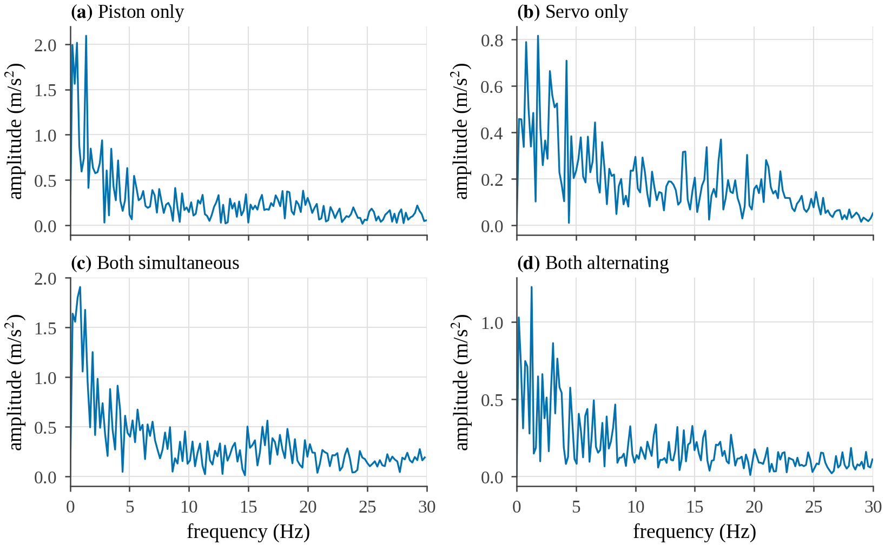

The FFT amplitude spectrum of `|a|` for each class (0–30 Hz). All classes concentrate their
energy **below ~5 Hz** (the slow push–pull and rotation rates plus their harmonics). Note the
different amplitude scales: piston and both-simultaneous reach ~2 m/s², servo only ~0.8 —
consistent with servo being the lowest-energy motion. The spectra are the raw material the
frequency-domain features summarize.

---

## 7. Time-domain features (`time_domain_analysis.py`)

Four numbers per axis, computed on the gravity-removed signal:

| Feature | Formula | Meaning |
|---|---|---|
| **RMS** | √(mean(x²)) | overall vibration energy level |
| **Peak-to-peak (P2P)** | max − min | the largest swing |
| **Crest factor** | peak / RMS | how "spiky" — high = sharp transients on a quiet background |
| **Kurtosis** | excess kurtosis | heavy-tailed / impulsive vs smooth (Gaussian = 0) |

---

## 8. Frequency-domain features (`frequency_domain_analysis.py`)

Computed per axis after removing the DC component:

| Feature | Meaning |
|---|---|
| **FFT dominant frequency / amplitude** | the single strongest vibration frequency and its size |
| **PSD spectral centroid** | the "centre of mass" of the spectrum (Hz) — where energy sits |
| **PSD spectral bandwidth** | how spread out the energy is around the centroid |
| **PSD spectral RMS / total power** | total energy in the spectrum (≈ time-domain RMS) |
| **PSD F95** | frequency below which 95 % of the power lies |
| **CWT dominant frequency / amplitude** | same idea via wavelets (good for transients) |
| **CWT global / mean wavelet power** | total time–frequency energy |

The script also saves per-trial FFT/PSD/spectrogram/CWT plots and CSVs under
`results/frequency_domain_analysis/` (the large CWT CSVs there are intermediate and not needed
downstream).

---

## 9. The feature matrix — what a "feature vector" actually is

`results/tables/feature_matrix.csv` is the bridge from signals to machine learning. It is a
**60 × 64** table: **one row per recording**, **64 columns** describing it — its *vibration
fingerprint*.

**The 64 features:**

- **Time-domain:** RMS, P2P, crest, kurtosis → × 4 axes (x, y, z, |a|) = **16**
- **Frequency-domain:** the 11 metrics above → × 4 axes = **44**
- **Engineered:** `xy_TotalPower`, `z_TotalPower`, `z_over_xy_power`, `xy_RMS` = **4**
- **Total = 64**

You can read the class straight off a few of these numbers:

| feature | **piston** t01 | **servo** t01 | **both-alt** t01 |
|---|---:|---:|---:|
| `z_TotalPower` (linear energy) | 15.8 | **0.02** | 4.6 |
| `xy_TotalPower` (rotation energy) | **0.26** | 4.3 | 4.2 |
| `z_over_xy_power` (the ratio) | **60.8** | **0.004** | **1.1** |

Piston = all z / no x–y; servo = all x–y / no z; the "both" classes = both.

---

## 10. Why per-recording features, not per-row (the key idea)

A natural question: there are ~120,000 raw readings — why not classify each one and get a
huge dataset? We tested it. The answer is that a single instant does not contain the class,
so it fails when evaluated honestly:

| Approach (honest, split by recording) | Accuracy |
|---|---:|
| per-row raw (aₓ, a_y, a_z) | 47 % |
| per-row **engineered** (magnitude, energy split, angle) | 54 % |
| chance | 25 % |
| **per-recording features (what we use)** | **95–97 %** |

Engineering *helps* (47 → 54 %), but hits a hard wall: at a single instant, `both-alternating`
looks like either piston or servo (whichever is firing that millisecond), and *"alternating vs
simultaneous" is a property that only exists across time* — you cannot see it in one frozen
sample. A per-row model with a *random* split can look good (~68 %), but that number is a
**leakage artifact**: neighbouring rows from the same recording end up in both train and test,
so the model memorizes recordings rather than learning motion. The honest unit is one feature
vector per recording (or per short *window* — see Future Work).

---

## 11. Exploratory data analysis (`scripts/eda.py`)

### 11.1 Class separation in two features
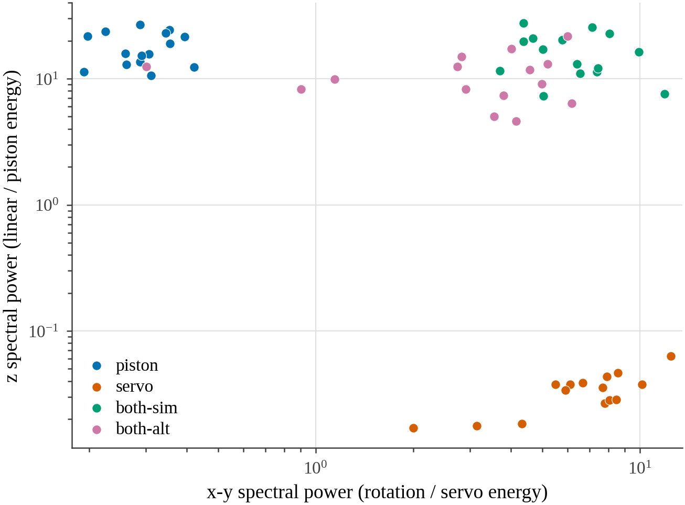

Every recording plotted by its x–y energy (horizontal) vs z energy (vertical), log–log.
Servo sits alone at the bottom (no z), piston alone at the left (no x–y), and the two "both"
classes cluster top-right. Three groups separate with just two features; the both-sim / both-alt
overlap here is what makes the fourth class the hard one.

### 11.2 Feature distributions
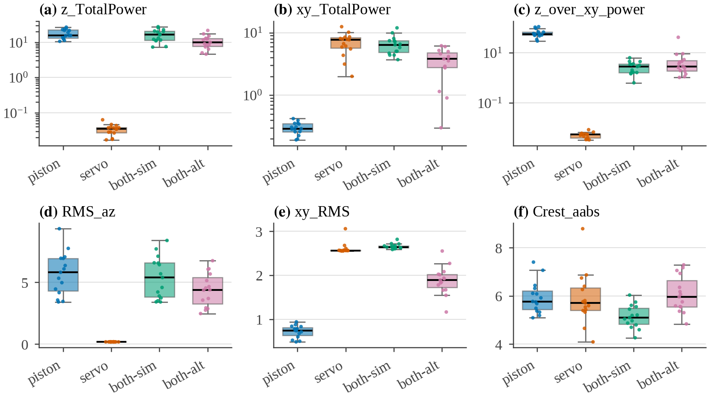

Box-and-point distributions of six informative features per class. `z_TotalPower` isolates
servo (near zero); `xy_TotalPower` isolates piston (near zero); `xy_RMS` is lower for
both-alternating than both-simultaneous (the servo is only on part of the time) — the handle
that separates the hard pair. `CrestFactor` overlaps across classes (a weak feature).

### 11.3 Which features discriminate best
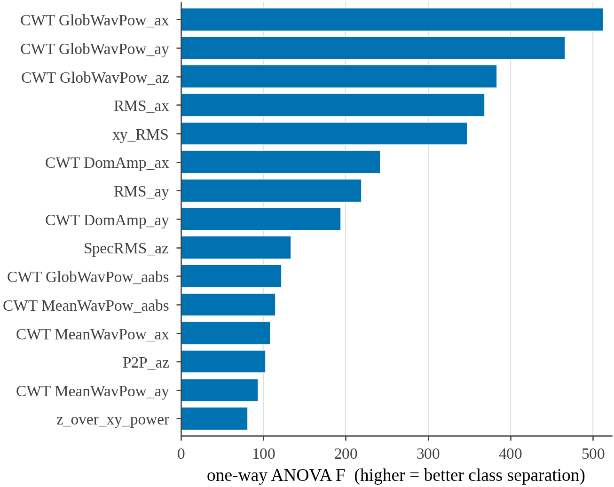

Features ranked by one-way ANOVA F-statistic (higher = separates the four classes better). The
CWT global-wavelet-power and RMS features (energy measures) dominate; shape features rank low.
The huge F-values (top ≈ 500, p ≈ 10⁻⁴⁰) mean the class differences are enormous, not marginal.

### 11.4 Feature redundancy
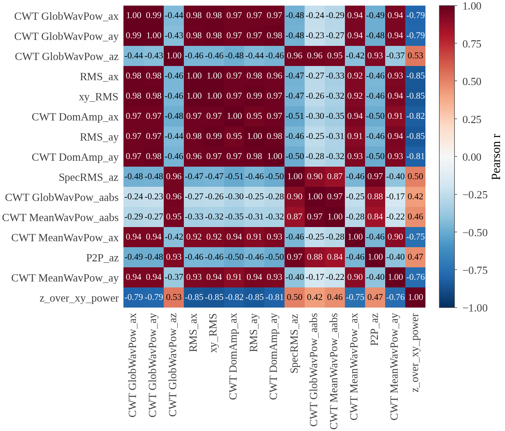

Correlation among the top 15 features. They collapse into **two blocks**: an x–y-energy block
and a z-energy block, ~0.9–1.0 correlated within and weakly correlated across. So despite 64
features, the information is essentially **2-dimensional** (x–y energy, z energy) — which is why
2–3 well-chosen features are enough and more would be redundant.

### 11.5 Multivariate structure
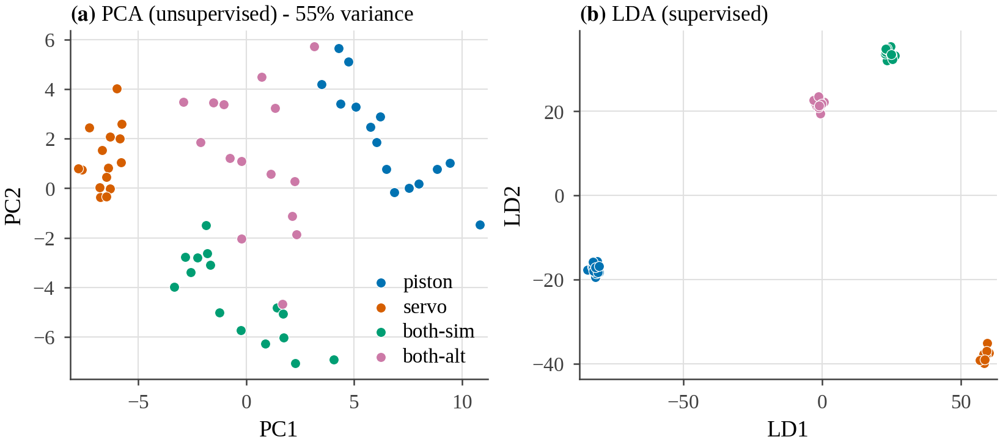

**(a) PCA** (unsupervised): 3 clusters clearly, both-alt spread through the middle.
**(b) LDA** (supervised): all four classes form tight, separated clusters — confirming the
classes *are* separable in the full feature space, including both-sim vs both-alt.
*(Caveat: LDA fit on 64 features / 60 samples flatters separation; trust it directionally.)*

---

## 12. Classification (`scripts/classify.py`)

**Features (3, per the brief):** `log10(z_TotalPower)`, `log10(xy_TotalPower)`, `xy_RMS` — one
from each energy block plus the x–y level that splits the "both" classes. (The two power
features are log-scaled because they span orders of magnitude.)

**Validation:** a **stratified 70/30 split** → 42 training / 18 held-out validation recordings,
*and* **stratified 5-fold cross-validation** over all 60. With only 60 recordings a single split
is noisy, so **the cross-validated number is the one to quote.**

### 12.1 Model comparison
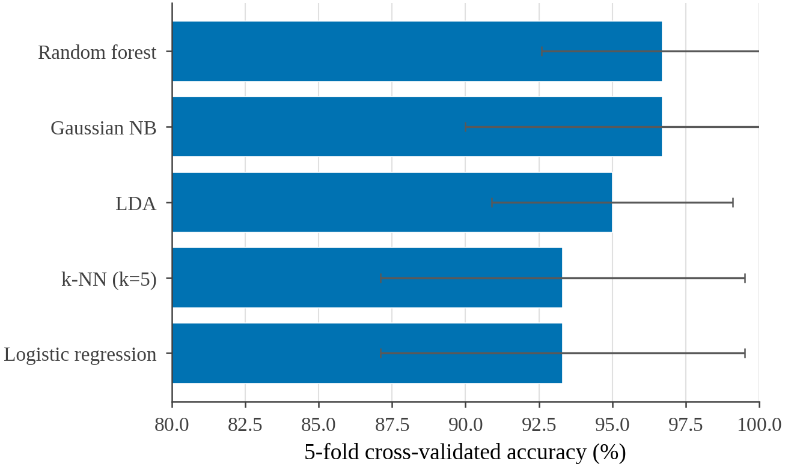

| Model | Validation | 5-fold CV | Pooled out-of-fold |
|---|---:|---:|---:|
| **Random forest** | 100 % | **96.7 % ± 4.1** | 96.7 % |
| **Gaussian NB** | 94.4 % | **96.7 % ± 6.7** | 96.7 % |
| LDA | 94.4 % | 95.0 % ± 4.1 | 95.0 % |
| k-NN (k=5) | 94.4 % | 93.3 % ± 6.2 | 93.3 % |
| Logistic regression | 88.9 % | 93.3 % ± 6.2 | 93.3 % |

All five land in a tight **93–97 %** band. "Pooled out-of-fold" means every recording was
predicted once by a model that never saw it (from `cross_val_predict`) — the fairest single
accuracy. **What each number means:** *validation* = accuracy on the 18 held-out trials;
*5-fold CV mean ± std* = average across five different held-out folds and how much it wobbles
between them; the ± is a real uncertainty band (small because n = 60).

### 12.2 Confusion matrices
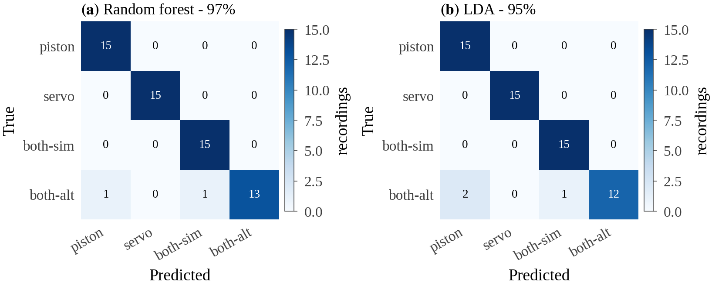

Pooled out-of-fold confusion for the two best models. Rows = true class, columns = predicted,
cells = number of recordings. **Piston, servo, and both-simultaneous are perfect (15/15).**
Every error is on **both-alternating** (Random forest 13/15, LDA 12/15), misread as piston or
both-simultaneous — exactly the temporal blind spot from Section 10.

### 12.3 Decision regions
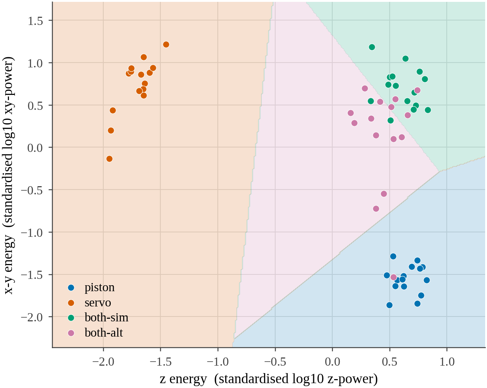

The classifier's decision boundaries in the two energy features (standardised). Each coloured
region is where a recording would be labelled that class. Servo owns the top-left, piston the
bottom-right, both-simultaneous the top-right — and **both-alternating sits in the thin wedge in
the middle, bordering all three**, which is precisely why its few errors happen.

### 12.4 Learning curves
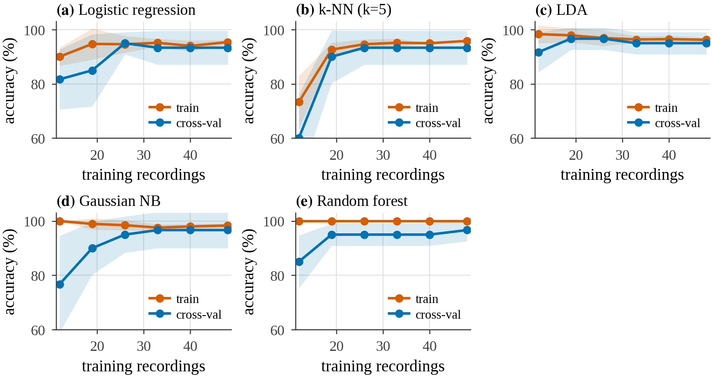

Accuracy vs number of training recordings (train in orange, cross-val in blue). *For these
non-iterative models, "training curve" means a **learning curve** — score vs training-set size;
a loss-vs-epoch curve does not apply.* All models **plateau by ~30 recordings**, so the flat
right-hand end says **more recordings of the same kind would barely help** — the ~95 % ceiling
is set by the features (missing temporal information), not by dataset size. The train–CV gap for
Random forest (train pinned at 100 %) shows its mild, expected overfitting.

---

## 13. Results and discussion

- **The four motion modes are genuinely distinct** — enormous effect sizes (ANOVA p ≈ 10⁻⁴⁰),
  and simple models reach ~95–97 % cross-validated accuracy on 3 interpretable features.
- **Three classes are essentially trivial** (piston, servo, both-simultaneous: perfect).
- **The one hard class is both-alternating.** It shares its ingredients with the others and
  differs only in *timing*, which static per-recording features capture only partly (via the
  lower average x–y energy). Every model shares this exact ceiling → it is a **feature**
  limitation, not a model limitation.
- **Simple beats complex here.** On 60 samples the fancier the model, the more it overfits;
  a linear/quadratic-free model (LDA, logistic, NB) is the right call, matching the brief.

---

## 14. Limitations

- **Small dataset (60 recordings).** Accuracy has a real ± ~5 % band; always quote the
  cross-validated figure, not a single split.
- **Single session / one rig.** The model learns *this* rig's signatures with a fixed mount; it
  would not transfer to another setup without new data.
- **Gravity-removal residual** (Section 4) makes the shape features (crest, kurtosis) noisy;
  we rely on energy features instead.
- **No temporal feature yet**, which is exactly why both-alternating is the ceiling.

---

## 15. Future work

- **Windowing + a temporal feature.** Cut each 5 s recording into ~1 s windows (→ a few hundred
  examples) and add a feature that measures how z-energy and x–y-energy *trade off over time*.
  That is the one lever expected to fix both-alternating and push past the ~97 % wall.
- **More sessions / remounts** to test whether the signatures generalize.

---

## 16. How to reproduce

From the repo root:

```bash
python3 data/raw/preprocessing.py data/raw            # raw -> data/preprocessed
python3 data/preprocessed/time_domain_analysis.py     # time-domain metrics
python3 data/preprocessed/frequency_domain_analysis.py# frequency-domain metrics
python3 scripts/eda.py                                # feature matrix + EDA figures
python3 scripts/signal_plots.py                       # signal & spectrum figures
python3 scripts/classify.py                           # models, curves, confusion
```

Outputs land in `results/tables/` (CSV) and `results/plots/` (PDF + PNG). All figures use the
vendored ICLR style in `scripts/iclr_style/`.

---

*See `RESULTS.md` for a condensed results-only summary.*
